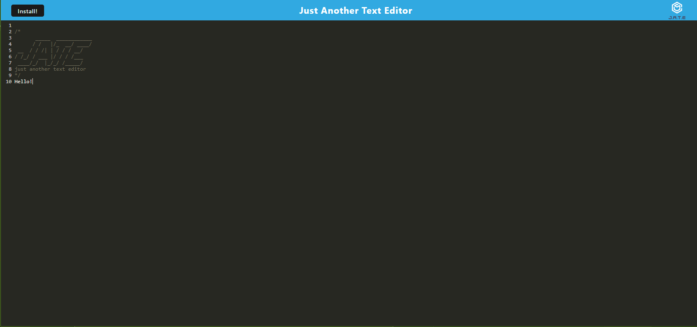

# Just Another Text Editor

This app is a text editor that can run inside a broswer. It's a single-page app that uses a progressive web application. There are also built in data storage methods so that even when the app closes, it will maitain inputs. The app can also be installed an run offline (Currently bugged).

## How to Run

In your prefered browser, you can navigate to the app using this link: https://justanothertexteditorturner.herokuapp.com/

## Screenshots

### Tools

Here is the list of tools I used in this app:

    - [Node.js](https://nodejs.org/en/)
    - [Express.js](https://expressjs.com/)
    - [IndexedDB](https://developer.mozilla.org/en-US/docs/Web/API/IndexedDB_API)
    - [WebPack](https://webpack.js.org/)
    - [Babel](https://babeljs.io/)